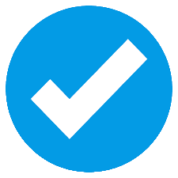
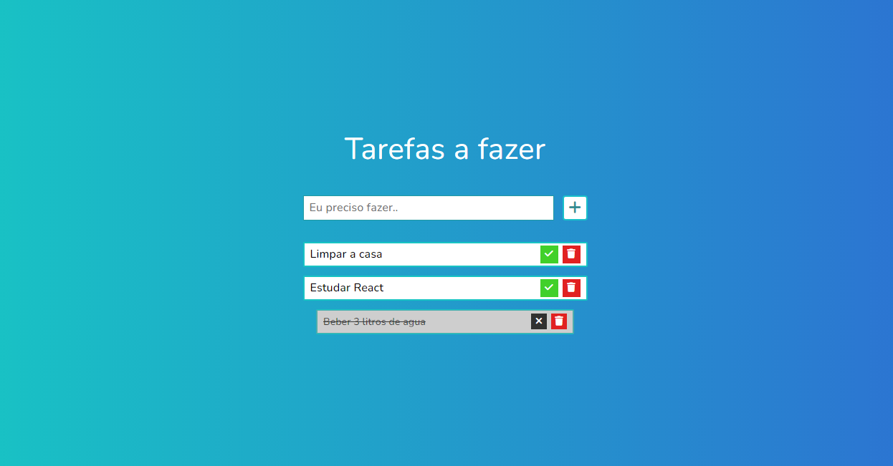
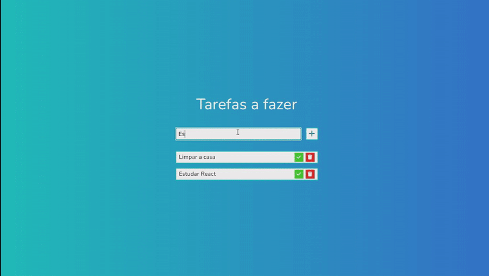

  

<h1 align="center">
    To do List (Lista de tarefas)
</h1>

<h4 align="center">
  Aplicação de To do list (Lista de tarefas) com ela se é possível: adicionar tarefas que irão ser feitas no dia a dia, marcar elas como concluída e também excluí-las.
  Através do desenvolvimento dela foi possivel aplicar pela primeira vez a metodologia BEM (Bloco, Elemento e Modificador) no qual é fácil de assimilar, cria uma estrutura escalável e também facilita a manutenção do código.
</h4>

    <a href="#🔗-clique-aqui-para-vizualizar-a-página!">Demonstração</a>&nbsp;&nbsp;&nbsp;|&nbsp;&nbsp;&nbsp;
    <a href="#🔨-tecnologias-usadas">Tecnologias usadas</a>&nbsp;&nbsp;&nbsp;|&nbsp;&nbsp;&nbsp;
    <a href="#🎯-features">Features</a>&nbsp;&nbsp;&nbsp;|&nbsp;&nbsp;&nbsp;
    <a href="#📝-licença">Licença</a>

 

### [🔗 Clique aqui para vizualizar a página!](https://mateuss18.github.io/To-do-list/)

  

 

  

>
---

## 🔨 Tecnologias usadas

###

>
---
## 🎯 Features

- Reponsividade Mobile e em telas 4k
- Animações de transição
- SASS utilizando metodologia BEM (Bloco, Elemento e Modificador)

---

## 📝 Licença   

Esse projeto está sob a licença MIT. Veja o arquivo [LICENSE](LICENSE) para mais detalhes.

---

Feito por Mateus Lopes :D ❤   

